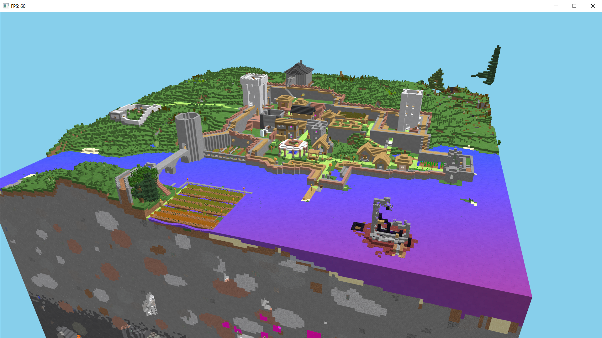
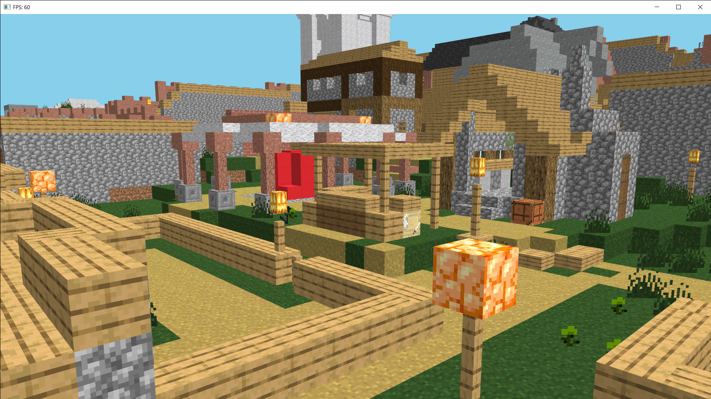

# cubeArray
cubeArray is a tool to 3d render minecraft schematic files, like .schem sponge formats.
You can fly through the landscape in FPV or view it from further away.

*THIS IS A WORK IN PROGRESS AND STILL VERY ROUGH*

## What it can do
This program can take a minecraft schematic file, like myHouse.schem which you previously exported from minecraft using WorldEdit f.e. and then 3d render it in a window where you can look at it, rotate it, zoom, fly and screenshot it.

## How to use it
Download the program and execute it. Select and load a schematic file.
A window will appear that shows your schematic. 

### Keybindings
rotate: Left click + drag
horizontal move: Right click + drag, A/W/S/D
vertical move: Q/E
fast move: move and hold left ctrl
zoom: Mouse wheel to zoom
spacebar: toggle autorotation
switch 3rd person/1st person: v

## Supported schematic formats
.schem

## Requirements
### Java installation
use java 17 (on old shitty x32 computers) or 21 (on normal computers) or newer. Older java installs will probably fail, and if you use java 7 it will definetly fail.

### OpenGL
The program uses OpenGL so it will need a graphics card. It was developed using a GTX 1060 and RTX5060-Ti and i strongly assume all nvidia cards will work.
I have no idea if AMD cards will work.

### Operating System
The program was developed on windows 10, thats really all i can tell you.
Usually the java JVM should shield the program from OS specific quirks, but i really dont have enough experience with cross OS developement to judge if this will hold.

## Limitations
### non-cubic block
normal 1x1x1m blocks for very well, but most special blocks like torches, fences, etc blocks will suffer and will not be displayed correctly.

### transparent blocks
transparency is very bitchy and i really dont care enough to fight 4 weeks to get it to work. sorry.

### lightning
its not raytracing, and i dont not calculate any shadows. The only lightsource is the sun and some ambient backlight.

### editing
its not a schematic editor. its a viewer.