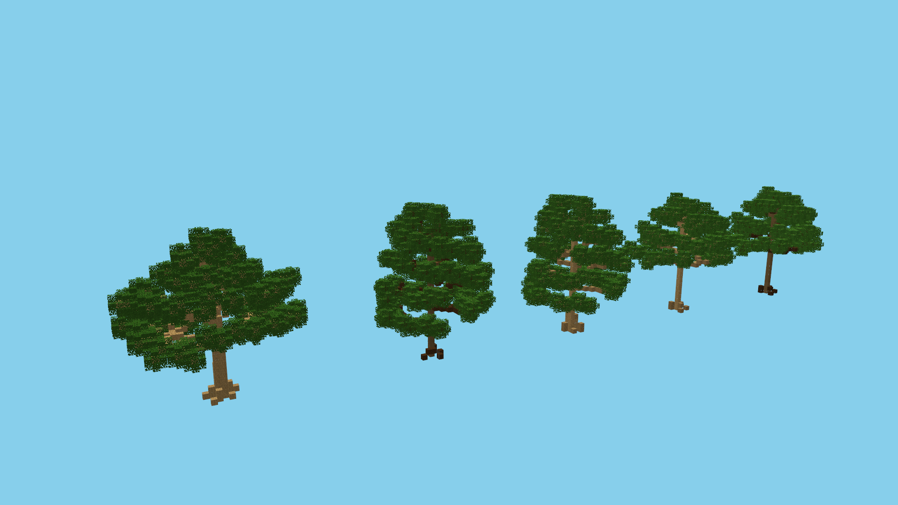
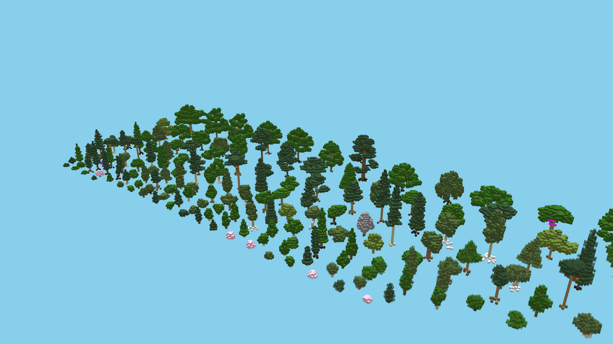

# CubeArray
CubeArray is a tool to 3d render minecraft schematic files, like .schem sponge formats.
You can fly through the landscape in FPV or view it from further away.

[Github repository](https://github.com/IR0NSIGHT/CubeArray)  
[Download latest release](https://github.com/IR0NSIGHT/CubeArray/releases)

*THIS IS A WORK IN PROGRESS*

## What it can do
This program can take a minecraft schematic file, like myHouse.schem which you previously exported from minecraft using WorldEdit f.e. and then 3d render it in a window where you can look at it, rotate it, zoom, fly and screenshot it.

## How to use it
1. Download the program and execute "CubeArray.exe". 
2. Select and load a schematic file.
3. A window will appear that shows your schematic. 

### Keybindings
See list at [KeyBindings.md](./KeyBindings.md)

## Supported schematic formats
1. .bo2
2. .bo3
3. .nbt
4. .schematic
5. .schem

## Requirements
### OpenGL
The program uses OpenGL so it will need a graphics card. It was developed using a GTX 1060 and RTX5060-Ti and i strongly assume all nvidia cards will work.
I have no idea if AMD cards will work.

### Operating System
The program was developed on windows 10, thats really all i can tell you.
Usually the java JVM should shield the program from OS specific quirks, but i really dont have enough experience with cross OS developement to judge if this will hold.

### Screenshots
in the install folder, you can find your screenshots:
f.e. C:\Users\MyWindowsUserName\AppData\Local\CubeArray\screenshots

you can probably use this link: [%USERPROFILE%\AppData\Local\CubeArray\screenshots](%USERPROFILE%\AppData\Local\CubeArray\screenshots) in your file explorer.

### Texture Packs
theoretically (untested) you can replace the texture pack in C:\Users\MyWindowsUser\AppData\Local\CubeArray\textures\Faithful_32x_1_21_7\assets . assuming that the assets follow a standard order, and are 32 pixels size, it should work.

## Limitations
### entities
can not display villagers, animals, etc. i think beds work? not sure.

### non-cubic block
normal 1x1x1m blocks for very well, but most special blocks like torches, fences, etc blocks will suffer and will not be displayed correctly.

### transparent blocks
transparency is very bitchy and i really dont care enough to fight 4 weeks to get it to work. sorry.

### lightning
its not raytracing, and i dont not calculate any shadows. The only lightsource is the sun and some ambient backlight.

### editing
its not a schematic editor. its a viewer.

## FAQ
- Where can i report bugs? 
  - Discord DM or make an issue https://github.com/IR0NSIGHT/CubeArray/issues
- I clicked "render" and nothing happened.
  - Its loading your schematic, but if the schematic is huge and your pc a potatoe, it will take some time. Wait at most 5 minutes.

## technical details
- scratch build in java using openGL bindings
- uses worldpainter as a library to import schematic files into the program
- uses textures from Faithful 32x - 1.21.7 resource pack: https://faithfulpack.net/
- front end is Java Swing
- 10% vibecoded. expect bugs
