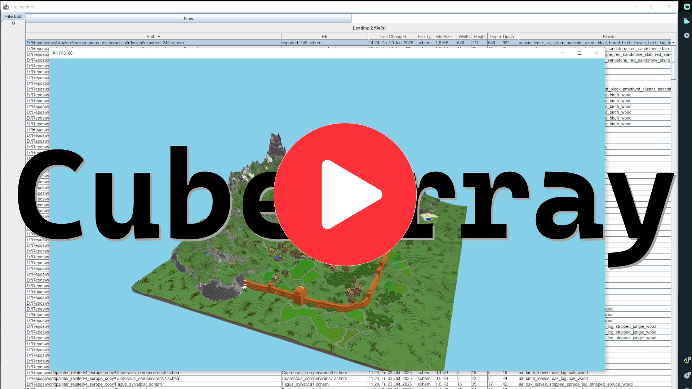
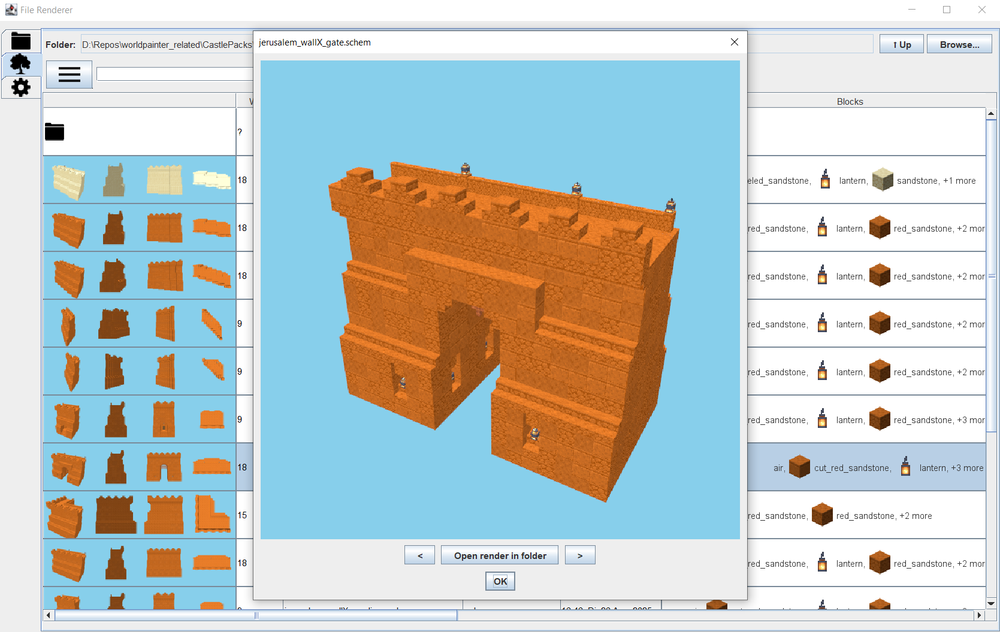
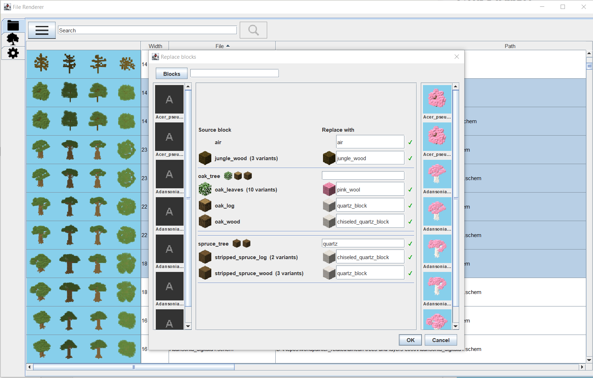
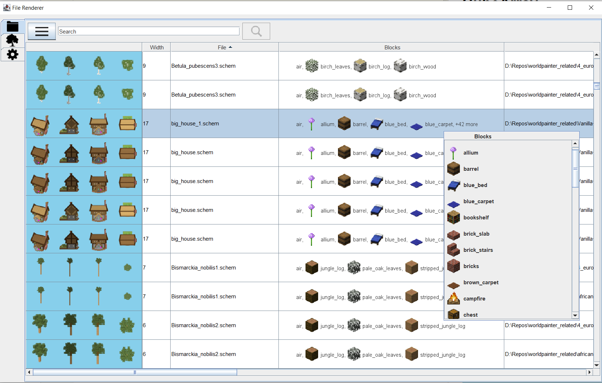
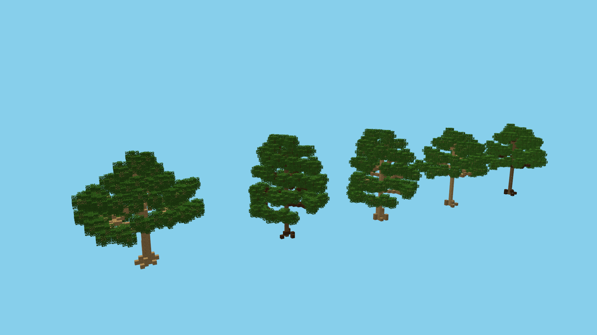
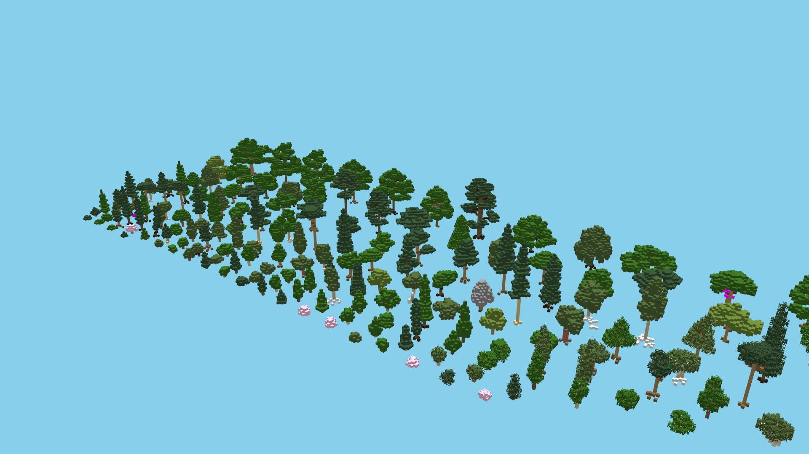
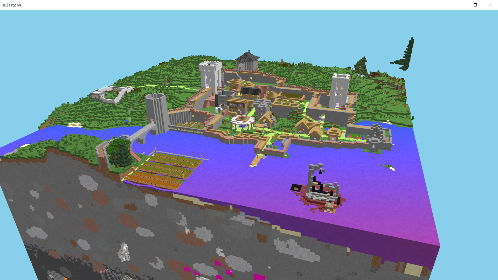

# CubeArray
CubeArray is a tool to organize your  3d render minecraft schematic files, like .schem sponge formats.
You can fly through the landscape in FPV or view it from further away.

[Github repository](https://github.com/IR0NSIGHT/CubeArray)  
[Download latest release](https://github.com/IR0NSIGHT/CubeArray/releases)

[](https://youtu.be/3LYkifQ4AOs)

Manage your complete schematics library with ease


Quickly see what the schematic looks like


Replace blocks on many schematics at once to create a new theme


Inspect the palette and other metadata


Use the 3d Renderer to look at your library from all sides





## What it can do
With this program, you import all your schematic files, then search through your new schematic database to quickly find the schematic you need. 

## How to use it
1. Download the program. Execute `CubeArray.exe` (no Java needed), or if you have Java 17+ installed, run `java -jar CubeArray.jar`. 
2. Import a schematic file or a whole folder.
3. The schematic now appears in your database table. 

### Keybindings of the 3d Renderer
See list at [KeyBindings.md](./KeyBindings.md)

## Supported schematic formats
1. .bo2
2. .bo3
3. .nbt
4. .schematic
5. .schem

## Requirements
### Operating System
Developed and test on windows 10 and Linux Mint 22. You will need to build it from source to use on linux, currently only windows releases exist.
MacOS is untested.

### Screenshots
in the install folder, you can find your screenshots:
go to settings > open-screenshot folder

### Texture Packs
1.26 Vanilla texture pack and block library is used right now, there is no support to place in your own resource pack atm.

## Limitations
### amount of schematics in the database
The program can comfortably handle 5000 schematics on a medium-shitty laptop.
An improved version to handle up to 100 000 schematics is in the works.

### entities
can not display villagers, animals, etc.

### non-cubic block
some blocks like lanters have shifted textures and look a bit wierd. 
some blocks with special geometry, like levers have shifted parts and look a bit wierd.

### transparent blocks
transparency is very bitchy and i really dont care enough to fight 4 weeks to get it to work. sorry.

### lightning
its not raytracing, and i dont not calculate any shadows. The only lightsource is the sun and some ambient backlight.

### editing
its not a schematic editor. its a viewer.

## FAQ
- Where can i report bugs? 
  - Discord DM or make an issue https://github.com/IR0NSIGHT/CubeArray/issues
- I clicked "render" and nothing happened.
  - Its loading your schematic, but if the schematic is huge and your pc a potatoe, it will take some time. Wait at most 5 minutes.

## technical details
- scratch built in java using openGL bindings
- uses worldpainter as a library to import schematic files into the program
- front end is Java Swing
- 20% vibecoded. expect bugs

# everything below this line is AI generated, do not trust it. verify every step yourself
###########################################


## Using CubeArray Core as a Maven dependency

CubeArray Core is published via [JitPack](https://jitpack.io/#IR0NSIGHT/CubeArray).  
Add the JitPack repository and the dependency to your `pom.xml`:

```xml
<repositories>
    <repository>
        <id>jitpack.io</id>
        <url>https://jitpack.io</url>
    </repository>
</repositories>

<dependency>
    <groupId>com.github.IR0NSIGHT</groupId>
    <artifactId>cubearray-core</artifactId>
    <version>v1.4.4</version>
</dependency>
```

### What you get

| Package | Purpose | LWJGL required? |
|---|---|---|
| `org.ironsight.cubearray.mcmodel` | Minecraft block model / blockstate parsing | No |
| `org.ironsight.cubearray.schematic` | Schematic file reading (sponge, .schem, .schematic, .nbt, .bo2, .bo3) | No |
| `org.ironsight.cubearray.edit` | Block replacement / batch conversion utilities | No |
| `org.ironsight.cubearray.platform` | Logging, resource utils, app info | No |
| `org.ironsight.cubearray.render` | OpenGL rendering (LWJGL) | **Yes** |
| `org.ironsight.cubearray.preview` | Headless schematic preview generation (Swing + LWJGL) | **Yes** |

LWJGL is declared as `<optional>true</optional>` in the core library — it is **not** pulled transitively. If you only use `mcmodel`, `schematic`, `edit`, or `platform`, no extra setup is needed.

### Setting up LWJGL for rendering / preview

If you use the `render` or `preview` packages, add LWJGL with platform-specific natives.  
Use the LWJGL BOM and Maven OS-activated profiles:

```xml
<dependencyManagement>
    <dependencies>
        <dependency>
            <groupId>org.lwjgl</groupId>
            <artifactId>lwjgl-bom</artifactId>
            <version>3.3.3</version>
            <type>pom</type>
            <scope>import</scope>
        </dependency>
    </dependencies>
</dependencyManagement>

<dependencies>
    <dependency>
        <groupId>org.lwjgl</groupId>
        <artifactId>lwjgl</artifactId>
    </dependency>
    <dependency>
        <groupId>org.lwjgl</groupId>
        <artifactId>lwjgl-glfw</artifactId>
    </dependency>
    <dependency>
        <groupId>org.lwjgl</groupId>
        <artifactId>lwjgl-opengl</artifactId>
    </dependency>
</dependencies>

<profiles>
    <!-- Windows natives -->
    <profile>
        <id>lwjgl-natives-windows</id>
        <activation>
            <os>
                <family>windows</family>
            </os>
        </activation>
        <dependencies>
            <dependency>
                <groupId>org.lwjgl</groupId>
                <artifactId>lwjgl</artifactId>
                <classifier>natives-windows</classifier>
            </dependency>
            <dependency>
                <groupId>org.lwjgl</groupId>
                <artifactId>lwjgl-glfw</artifactId>
                <classifier>natives-windows</classifier>
            </dependency>
            <dependency>
                <groupId>org.lwjgl</groupId>
                <artifactId>lwjgl-opengl</artifactId>
                <classifier>natives-windows</classifier>
            </dependency>
        </dependencies>
    </profile>

    <!-- Linux natives -->
    <profile>
        <id>lwjgl-natives-linux</id>
        <activation>
            <os>
                <family>unix</family>
            </os>
        </activation>
        <dependencies>
            <dependency>
                <groupId>org.lwjgl</groupId>
                <artifactId>lwjgl</artifactId>
                <classifier>natives-linux</classifier>
            </dependency>
            <dependency>
                <groupId>org.lwjgl</groupId>
                <artifactId>lwjgl-glfw</artifactId>
                <classifier>natives-linux</classifier>
            </dependency>
            <dependency>
                <groupId>org.lwjgl</groupId>
                <artifactId>lwjgl-opengl</artifactId>
                <classifier>natives-linux</classifier>
            </dependency>
        </dependencies>
    </profile>

    <!-- macOS natives (x86_64) -->
    <profile>
        <id>lwjgl-natives-macos</id>
        <activation>
            <os>
                <family>mac</family>
            </os>
        </activation>
        <dependencies>
            <dependency>
                <groupId>org.lwjgl</groupId>
                <artifactId>lwjgl</artifactId>
                <classifier>natives-macos</classifier>
            </dependency>
            <dependency>
                <groupId>org.lwjgl</groupId>
                <artifactId>lwjgl-glfw</artifactId>
                <classifier>natives-macos</classifier>
            </dependency>
            <dependency>
                <groupId>org.lwjgl</groupId>
                <artifactId>lwjgl-opengl</artifactId>
                <classifier>natives-macos</classifier>
            </dependency>
        </dependencies>
    </profile>
</profiles>
```

For Apple Silicon (ARM64) Macs, replace `natives-macos` with `natives-macos-arm64` in the macOS profile, or include both classifiers.

> **Note:** CubeArray has only been tested on Windows and Linux. macOS support via LWJGL should work in theory but is untested.

### Transitive dependencies

CubeArray Core depends on:
- **JOML** (`org.joml:joml:1.10.5`) — available from Maven Central
- **WPCore** (`org.pepsoft.worldpainter:WPCore:2.25.0`) — requires the [EngineHub repository](https://maven.enginehub.org/repo/)
- **SchemConvert** (`com.github.PiTheGuy:SchemConvert:v1.2.5`) — published on JitPack
- **Jackson** (`com.fasterxml.jackson.core:jackson-databind:2.19.1`) — available from Maven Central
- **Commons IO** (`commons-io:commons-io:2.14.0`) — available from Maven Central

If your project has resolution issues with `WPCore`, add the EngineHub repository to your `pom.xml`:

```xml
<repository>
    <id>enginehub</id>
    <url>https://maven.enginehub.org/repo/</url>
</repository>
```

### Quick usage example

```java
import org.ironsight.cubearray.schematic.SchemReader;
import org.pepsoft.worldpainter.objects.WPObject;
import java.io.File;
import java.util.List;

public class Example {
    public static void main(String[] args) throws Exception {
        SchemReader reader = new SchemReader();
        List<WPObject> objects = reader.loadSchematic(new File("build.schem"));
        System.out.println("Loaded " + objects.size() + " objects");
    }
}
```
